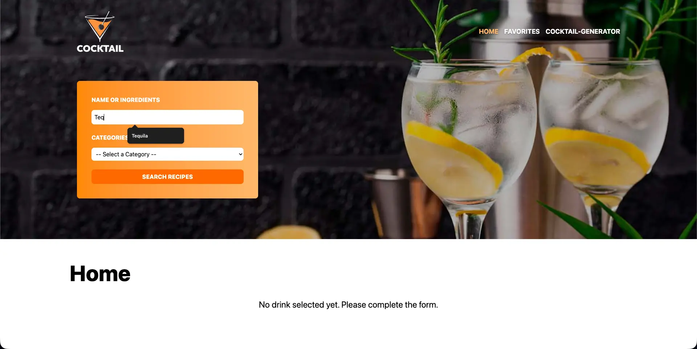
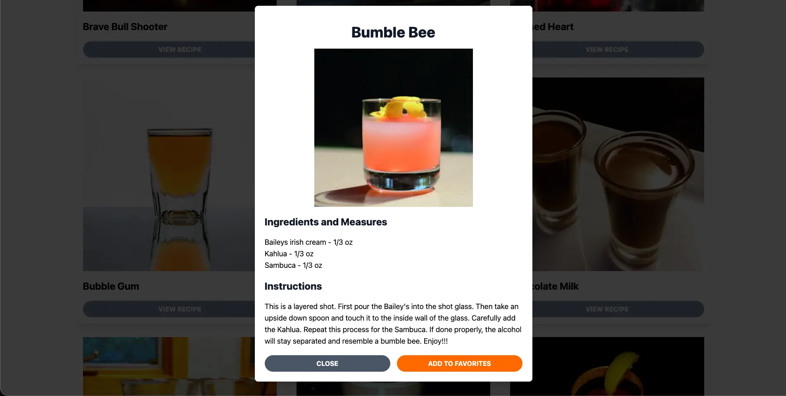
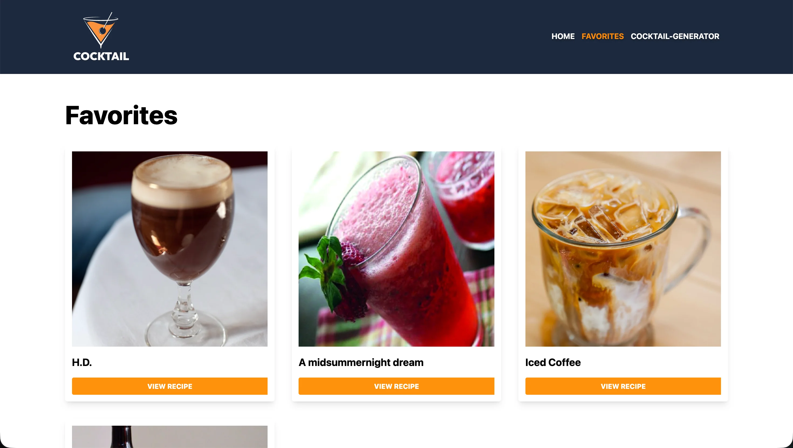
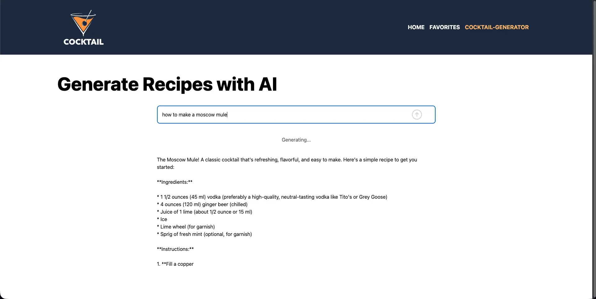

<table width="100%" align="center">
  <tr>
    <td align="center" valign="middle">
      <h1>🍸 Cocktails AI - Cocktails Recipes Platform</h1>
      
<b>Plataforma Dual: Buscador de API & Generador con IA</b>

      

      
React | Zustand | Zod | Vercel AI SDK | OpenRouter | Axios | React Router | Tailwind CSS

    </td>
  </tr>
</table>

<table>
  <tr>
    <td width="50%">
      

        
      

    </td>
    <td width="50%">
      

        
      

    </td>
  </tr>
  <tr>
    <td width="50%">
      

        
      

    </td>
    <td width="50%">
      

        
      

    </td>
  </tr>
</table>

## Visión General

**Cocktails AI** es una aplicación moderna que fusiona dos mundos: la consulta de datos estructurados y la inteligencia artificial generativa.

La aplicación funciona bajo un modelo híbrido:
* **Modo Exploración:** Consume una base de datos de coctelería externa para buscar recetas clásicas estandarizadas.
* **Modo Creativo (IA):** Utiliza Inteligencia Artificial para generar recetas nuevas basadas en los ingredientes que el usuario tiene a mano.

Esta arquitectura demuestra la capacidad de integrar múltiples fuentes de verdad (API REST + LLM Streaming) en una interfaz de usuario coherente y fluida.

---

## Stack Tecnológico y Justificación de Arquitectura

Cada librería fue seleccionada para resolver una necesidad específica del flujo de datos y la experiencia de usuario:

| Tecnología | Implementación y Justificación en el Proyecto |
| :--- | :--- |
| **Vercel AI SDK & OpenRouter** | **Motor Generativo.** Vercel AI SDK gestiona la interfaz y permite manejar respuestas en **streaming** (mostrando la receta palabra por palabra en tiempo real). Se integra directamente con el proveedor `@openrouter/ai-sdk-provider`, el cual unifica y enruta nuestras peticiones hacia los modelos de lenguaje (LLM) subyacentes. |
| **Axios** | **Cliente HTTP.** Utilizado para la comunicación con la API REST externa (Base de datos de Cócteles). Elegido sobre `fetch` por su manejo automático de JSON y la facilidad para configurar interceptores para escalar las peticiones. |
| **Zustand** | **Gestión de Estado Global.** Reemplaza a Context API/Redux para manejar el estado de la aplicación (filtros de búsqueda, modal de receta activa). Su arquitectura basada en hooks permite acceder a los datos de la bebida seleccionada desde cualquier componente. |
| **Zod** | **Integridad de Datos.** Implementado para validar los formularios de entrada (tanto búsqueda como generación). Asegura que los datos enviados a la API o al prompt de la IA cumplan con el esquema esperado (tipos correctos, campos obligatorios), previniendo errores en tiempo de ejecución. |
| **React Router DOM** | **Enrutamiento SPA.** Gestiona la navegación entre la vista de búsqueda (Home) y los detalles o favoritos. Permite una experiencia de Single Page Application fluida, manteniendo la sincronización con la URL. |

---

## Desafíos Técnicos Resueltos

### 1. Arquitectura de Motores de Búsqueda Independientes
El reto fue implementar un sistema dual donde conviven dos métodos de obtención de datos con naturalezas opuestas:
* **Motor Estático (TheCocktailDB):** Consultas vía Axios que devuelven colecciones de tarjetas con datos estructurados para la exploración rápida del catálogo.
* **Motor Generativo (IA):** Un flujo de datos basado en LLM Streaming a través de OpenRouter que opera en una ruta exclusiva, dedicado a la creación de recetas personalizadas en tiempo real.

**Solución:** Implementé una gestión de rutas y estados con React Router y Zustand que separa estrictamente ambos flujos. Esto garantiza que la carga de la IA no afecte el rendimiento de la navegación de la base de datos y mantiene la interfaz clara.

### 2. Gestión de Estado Asíncrono Complejo
Coordinar las peticiones de Axios (búsqueda tradicional) con el streaming del AI SDK requería un store robusto. Utilicé **Zustand** para centralizar la lógica de las acciones. Esto separó la lógica de negocio de los componentes visuales, logrando un código más limpio y mantenible.

### 3. Validación de Entradas para IA
Para evitar gastar recursos y tokens en consultas a la IA con datos incompletos o mal formados, implementé esquemas de **Zod**. Estos validan los ingredientes ingresados por el usuario antes de invocar la generación de texto del SDK, garantizando que el prompt enviado a OpenRouter sea siempre óptimo.